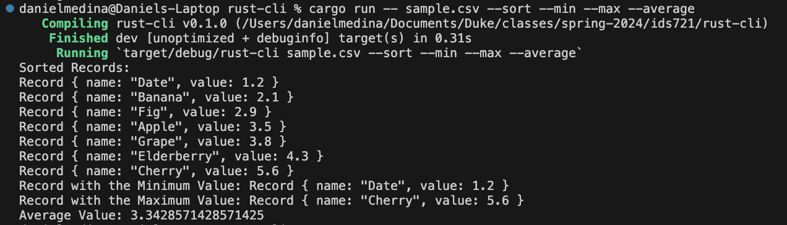
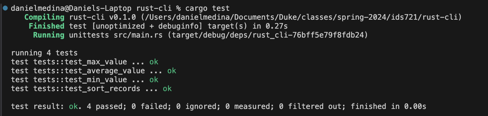

# CSV Processor CLI Tool

By Daniel Medina

## Introduction

This command-line tool is designed for efficient processing of CSV files. It allows users to perform various data operations such as sorting, filtering, and aggregating data directly from the command line. Developed in Rust, it offers high performance and reliability, making it suitable for handling large datasets.

## Tool Functionality

The CSV Processor provides the following functionalities:

- **Sorting**: Users can sort data based on specific columns, enabling quick organization and analysis of CSV contents.
- **Minimum and Maximum Values**: The tool can return records with the minimum and maximum values from a specified column, aiding in data range assessments.
- **Average Calculation**: It computes the average value of a column, useful for statistical analysis and trend identification.

These operations help in transforming and summarizing CSV data effectively, making it easier for users to derive insights from their datasets.



## Data Processing

To use the tool, input your CSV file as the first argument followed by the desired operation flags:

- `--sort`: Sorts the records based on the numerical column 'value'.
- `--min`: Outputs the record with the minimum value in the 'value' column.
- `--max`: Outputs the record with the maximum value in the 'value' column.
- `--average`: Calculates and returns the average of the numerical 'value' column.

The tool assumes that the CSV file has headers and that the 'value' column contains numerical data.

## Testing Implementation

Testing is an integral part of this tool's development, ensuring accuracy and reliability of its features. The following testing methodologies are implemented:

- **Unit Tests**: Functions for sorting, calculating minimum, maximum, and average values are covered by unit tests. These tests validate the correctness of the data processing logic under various conditions.
- **Integration Tests**: The tool's ability to read and process data from CSV files is validated through integration tests, ensuring that the entire data processing pipeline works as expected.

To run the tests, use the command `cargo test` in the project's root directory. This will execute all the tests and output the results, indicating whether each test has passed or failed.

Testing Report:



## Usage

To start using the CSV Processor, clone the repository and build the project using Cargo:

```bash
git clone <repository-url>
cd csv-processor
cargo build --release
